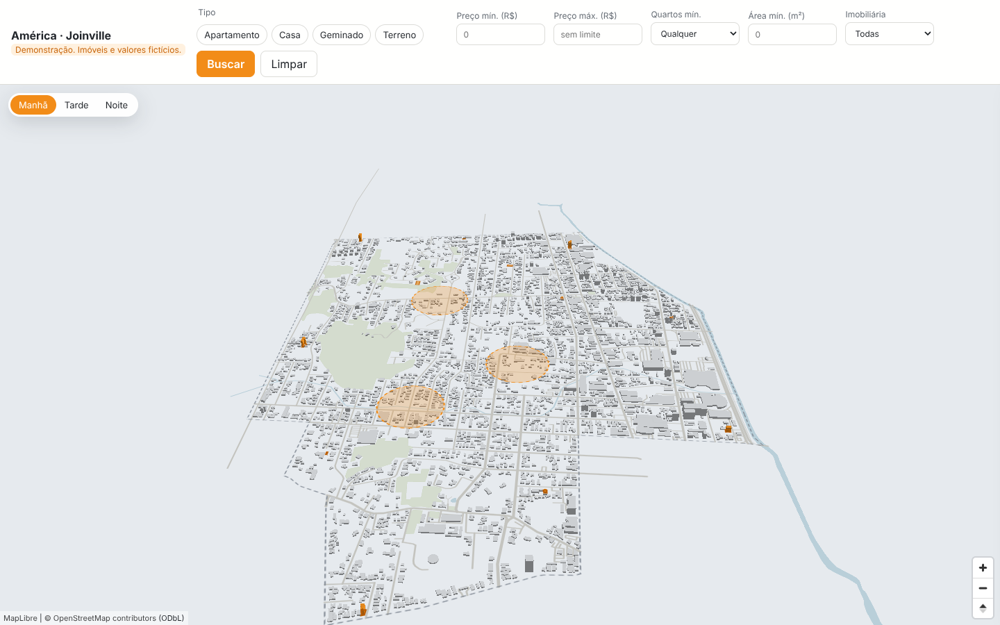

# Mapa 3D imobiliário: bairro América (Joinville/SC)

Protótipo de **demonstração** de um portal imobiliário com mapa 3D. O bairro aparece como uma maquete neutra
(prédios em cinza) e apenas os imóveis à venda ficam destacados e clicáveis.

> **Imóveis, imobiliárias e valores são FICTÍCIOS.** Os prédios, as vias, a água, as áreas verdes e o limite do
> bairro vêm do OpenStreetMap (© OpenStreetMap contributors, ODbL).



## Como instalar e rodar

Requisitos: Node.js 22+ e npm.

```bash
npm install
npm run dev       # servidor de desenvolvimento (http://localhost:5173)
npm run build     # tsc --noEmit + build de produção em dist/
npm run preview   # serve o dist/
npm test          # testes unitários (Vitest)
```

Os dados já estão versionados em `public/data/`, então o app funciona sem rede e sem nenhum servidor de tiles.

### Verificações extras

```bash
npm run validate:data   # valida listings.json contra os GeoJSON do OSM
npm run build && npm run verify:e2e   # Playwright: abre o app, testa interações e salva screenshots em docs/screenshots/
```

O `verify:e2e` usa o Chromium indicado em `CHROMIUM_PATH` ou, se existir, `/opt/pw-browsers/chromium`. Caso
contrário, usa o navegador baixado pelo Playwright (`npx playwright install chromium`).

## Como regenerar os dados

```bash
npm run data
# atrás de proxy HTTP(S), o fetch nativo do Node só usa o proxy com:
NODE_USE_ENV_PROXY=1 npm run data
```

1. `scripts/fetch-osm.mjs`:
   - Localiza "América, Joinville, Santa Catarina, Brasil" no **Nominatim**, com User-Agent identificável e espera de 1 s entre requisições.
   - Usa o polígono administrativo quando existe; se não existir, usa um bbox de ~1 km de raio.
   - Consulta o **Overpass** restrito a esse polígono, com novas tentativas com espera crescente e depois espelhos alternativos.
   - Converte o resultado com `osmtogeojson` e grava `boundary`, `buildings`, `roads`, `water`, `green` e `meta.json` em `public/data/`.
   - Guarda as respostas brutas em `.cache/osm/`, o que torna o script idempotente. Use `--refresh` para baixar de novo.
2. `scripts/generate-listings.mjs`: gera `public/data/listings.json` de forma determinística (seed `20261007`).
3. `scripts/validate-listings.mjs`: verificações de consistência (ver abaixo).

Se o Nominatim ou o Overpass falharem, o script termina com erro e **não gera dados substitutos**.

## Estrutura

```
scripts/        fetch-osm, generate-listings, validate-listings, e2e-check, lib/height (regra de renderHeight)
public/data/    GeoJSON do OSM + listings.json (fictício) + meta.json
src/data/       tipos, validação em tempo de carga, carregamento
src/state/      filtros: lógica pura + FilterStore (estado pendente × aplicado)
src/map/        cena MapLibre (camadas, destaque, hover, câmera) e iluminação (suncalc)
src/ui/         filtros, lista de resultados, drawer, seletor manhã/tarde/noite
src/utils/      simulação de pagamento, planta SVG ilustrativa, formatação
tests/          Vitest: renderHeight, filtros, simulação de pagamento
docs/screenshots/  capturas geradas pelo verify:e2e
```

## Versões usadas (confirmadas com `npm view` e nos `.d.ts` instalados)

| Pacote | Versão |
|---|---|
| maplibre-gl | 6.13.0 |
| @turf/* (módulos individuais) | 7.4.0 |
| osmtogeojson | 3.0.0-beta.5 |
| suncalc | 2.1.1 |
| vite | 8.3.3 |
| typescript | 7.0.2 |
| vitest | 5.0.3 |
| playwright | 1.63.0 |

### Adaptações às APIs instaladas

- **MapLibre 6** só tem exports nomeados (`import { Map } from 'maplibre-gl'`, sem `default`). Ele carrega o worker de
  um arquivo separado (`maplibre-gl-worker.mjs`), que o Vite não emite sozinho. Por isso o app importa esse arquivo com
  `?url` e chama `setWorkerUrl()` (veja `src/main.ts`).
- **Luz no MapLibre 6**: a especificação `light` tem só `anchor`, `position [r, azimute, polar]`, `color` e `intensity`.
  Ela sombreia as faces das extrusões conforme a direção da luz, mas **não projeta sombras** no chão nem entre prédios.
  Também usamos `sky` (`sky-color`, `horizon-color`, `fog-color`), que aparece quando a câmera mostra o horizonte.
- **suncalc 2.x** traz tipos próprios e mudou a convenção da 1.x: `azimuth` e `altitude` vêm em **graus**, com azimute a
  partir do **norte**, no sentido horário. Na 1.x eram radianos, medidos a partir do sul. O pacote `@types/suncalc`
  (que descreve a 1.x) foi removido. O mapeamento para o MapLibre fica `position = [1.5, azimute, 90 − altitude]` com
  `anchor: "map"`.
- **Turf 7.4**: `nearestPointOnLine` marca `dist` e `index` como obsoletos. Usamos `pointDistance` e `segmentIndex`.
- **Playwright 1.63** espera um build de Chromium que não estava instalado no ambiente. O script aceita
  `executablePath` (Chromium pré-instalado) em vez de baixar outro.

## Decisões e premissas

- **Limite do bairro**: **administrativo**. O Nominatim retornou a relação OSM
  [3482571](https://www.openstreetmap.org/relation/3482571) (`boundary=administrative`, "América, Joinville") com
  polígono, e ele é usado tanto na consulta ao Overpass (`area(id:3603482571)`) quanto no mapa. O Overpass devolve
  elementos com **algum nó** dentro da área, então vias e rios que cruzam o limite aparecem inteiros, um pouco além
  dele (por isso o bbox dos dados é maior que o do limite).
- **Altura dos prédios (`renderHeight`)**: tag `height`, se válida; senão `building:levels × 3 m`; senão 6 m.
  Valores como `"12 m"` e `"7,5"` são aceitos. Valores inválidos (`"3;4"`) caem na regra seguinte.
- **Prédios residenciais elegíveis** para imóveis: `building` ∈ {yes, house, residential, apartments, detached,
  semidetached_house, terrace}, sem as tags `amenity`, `shop`, `office`, `healthcare`, `craft`, `tourism`,
  `leisure`, `religion`, `denomination` e `industrial`, e **sem `name`**. Prédios com nome costumam ser pontos de
  referência, então foram excluídos por precaução. O centróide precisa estar dentro do limite do bairro.
- **Apartamentos** só usam prédios com área de projeção ≥ 250 m². A altura do prédio no mapa é sobrescrita por
  `floors × 3 m` (8 a 14 pavimentos fictícios).
- **Geminados**: se houver pelo menos 3 prédios marcados como `semidetached_house` ou `terrace`, só eles são usados;
  senão, prédios residenciais de 50 a 220 m².
- **Espalhamento**: seleção por *farthest-point sampling* determinística, ou seja, cada novo imóvel fica o mais longe
  possível dos já escolhidos.
- **Terrenos**: retângulos de 12×30, 15×30, 15×35 ou 20×40 m, alinhados ao segmento da via carroçável mais próxima,
  com a frente voltada para ela. Precisam estar dentro do limite e **não podem intersectar** prédios, vias, água, áreas
  verdes ou outro terreno (validado com Turf). Se não houver espaço, o tamanho é reduzido para 10×25 e depois 8×20 m,
  com registro. A extrusão é de 0,5 m.
- **Localização aproximada** (3 imóveis: 1 casa, 1 geminado e 1 terreno): o centro exibido é deslocado de 50 a 149 m
  numa direção derivada do hash do `id`, de forma determinística. O mapa mostra um círculo de 150 m e não destaca o
  imóvel exato, cujo prédio fica cinza como os demais. Como o deslocamento é menor que o raio, o círculo sempre contém
  o local real.
- **Preços** são **valores ilustrativos**: área × R$/m² sorteado em faixas plausíveis (apartamento 8.000–11.500,
  casa 6.500–9.500, geminado 5.800–7.800, terreno 1.400–2.400 por m² de lote), arredondados a R$ 5.000. Não refletem
  o mercado real.
- **Imobiliárias**: "Imobiliária Exemplo A" e "Imobiliária Exemplo B", alternadas entre os imóveis.
- **Títulos e descrições** são genéricos e não citam nomes de ruas, para não sugerir endereço real.
- **Filtros**: o formulário altera só o estado *pendente* (`FilterStore.setPending`), e o mapa só muda com **Buscar**
  (`apply()`). **Limpar** zera o formulário e também a busca aplicada, por ser um clique explícito. Um aviso
  "Alterações não aplicadas" aparece quando o formulário difere do que está aplicado.
- **Imóveis esmaecidos**: cinza semitransparente (opacidade 0,4) e não clicáveis. Quando o filtro inclui algum imóvel,
  a câmera enquadra todos os resultados (`fitBounds`).
- **Contorno**: as extrusões do MapLibre não têm contorno próprio, então o destaque usa uma camada `line` na base
  do polígono.
- **Simulação de pagamento**, sem juros:
  - Pronto: 20% de entrada e 120 parcelas iguais.
  - Em construção: 20% de entrada, 4 reforços anuais de 5% do preço e o saldo (60%) em 60 parcelas.
  - Valores arredondados aos centavos.
- **Iluminação**: data de referência fixa em 20/03/2026 (equinócio), fuso UTC−03:00 (Joinville não tem horário de
  verão desde 2019). Manhã às 09:00, tarde às 15:00, noite às 21:00 (sol abaixo do horizonte). As coordenadas vêm de
  `meta.json`, gravado pelo Nominatim. À noite, como não há sol, usamos uma luz fraca, fria e vinda de cima, para os
  volumes continuarem legíveis.
  - A altitude do sol é limitada a um ângulo polar entre 10° e 80°, para as faces não ficarem totalmente escuras.
- **Planta**: SVG genérico com retângulos (sala, cozinha, quartos, banhos), em escala proporcional à raiz da área.
  Terrenos mostram só o contorno do lote.
- **Sem servidor de tiles e sem fontes externas**: o estilo não tem `glyphs` nem `sprite`, então não há rótulos de
  texto no mapa.

## Limitações conhecidas

- O MapLibre não projeta sombras. A "direção do sol" aparece só no sombreamento das faces dos prédios.
- Muitos prédios do OSM não têm altura nem número de pavimentos e usam a altura padrão de 6 m. Veja as contagens abaixo.
- A qualidade do mapeamento de prédios no OSM varia. Pode haver quadras sem prédios mapeados ou com contornos
  desatualizados.
- O bundle JS tem ~1 MB, quase todo do MapLibre. Não houve otimização de tamanho.
- Os terrenos fictícios ficam em áreas sem prédio **mapeado** no OSM. Na realidade podem existir construções ali.
- O contorno dos imóveis é desenhado só na base do volume.
- Muitos prédios do OSM têm só `building=yes`. Um prédio "residencial" escolhido pode, na realidade, ser comercial ou
  galpão, porque o filtro depende das tags existentes.
- Na visão geral do bairro, imóveis pequenos (casas, terrenos) aparecem como poucos pixels. A busca e a lista de
  resultados aproximam a câmera.
- `npm audit` aponta vulnerabilidades em `@xmldom/xmldom`, que vem pelo `osmtogeojson` 3.0.0-beta.5. É uma
  dependência só de desenvolvimento, usada no script de dados com entrada **JSON** do Overpass (o parser XML não é
  usado), e não entra no bundle do navegador. A "correção" sugerida rebaixaria para `osmtogeojson` 2.x, o que foi
  evitado.
- A renderização foi verificada só em Chromium headless com WebGL por software (SwiftShader). Não testei Safari,
  Firefox nem GPUs reais.

## Próximos passos (não implementados)

- Modelo 3D detalhado de um prédio "hero" com janelas por unidade e janelas acesas à noite, com Three.js como camada
  customizada do MapLibre (o `fill-extrusion` não suporta isso).
- Sombras reais (shadow mapping) via camada customizada.
- Rótulos de ruas, que exigem fontes/glyphs locais.
- Marcadores (pinos) para os imóveis em zoom baixo, para que fiquem visíveis na visão geral do bairro.
- Dados de imóveis vindos de uma API, com paginação e URL compartilhável da busca.
- Divisão do bundle (lazy-load do MapLibre) e simplificação da geometria dos prédios para dispositivos fracos.

## Dados (contagens da última execução)

Execução de 2026-10-07 (`public/data/meta.json`):

| Camada | Feições |
|---|---|
| Prédios (`building`) | 3.357 |
| ↳ altura pela tag `height` | 0 |
| ↳ altura por `building:levels × 3 m` | 235 |
| ↳ altura padrão de 6 m | 3.122 |
| Vias (`highway`) | 576 |
| Água (`natural=water`, `waterway`) | 15 |
| Áreas verdes (`leisure=park`, `landuse=grass/forest`, `natural=wood`) | 19 |

- Centro (Nominatim): −26,2903607, −48,8535810
- Bbox do limite: −48,864635, −26,303255, −48,842521, −26,277429 (W, S, E, N)
- Bbox de todos os dados: −48,865804, −26,314700, −48,804361, −26,268235

Imóveis fictícios (`listings.json`): 15 no total.

| Tipo | Quantidade | Observação |
|---|---|---|
| Apartamentos | 5 | 8 a 14 pavimentos fictícios |
| Casas | 4 | |
| Geminados | 3 | Escolhidos por área: o OSM do bairro não tinha ≥ 3 prédios `semidetached_house`/`terrace` |
| Terrenos | 3 | Nenhum precisou ser reduzido |

- 3 imóveis com localização aproximada: `house-06`, `semi-10` e `land-13`.
- Prédios residenciais elegíveis: 3.098.

## Verificação realizada

- `npm run build` (inclui `tsc --noEmit`): sem erros. Há só o aviso de chunk > 500 kB, por causa do MapLibre.
- `npm test`: 16 testes (renderHeight, filtros + FilterStore, simulação de pagamento).
- `npm run validate:data`:
  - ids únicos e `fictional: true` em todos;
  - todo `buildingOsmId` existe e é residencial, sem as tags excluídas;
  - terrenos dentro do limite e sem interseção com prédios, vias, água ou verde;
  - círculos aproximados contêm o local real.
- `npm run verify:e2e` (Playwright + Chromium headless com SwiftShader), 25 checagens:
  - camadas renderizadas;
  - atribuição e banner visíveis;
  - clique abre o drawer, e Esc, o botão × e o clique no mapa vazio fecham;
  - localização aproximada;
  - editar filtros **não** altera o mapa nem a câmera, e só "Buscar" aplica;
  - lista de resultados abre o imóvel e "Limpar" restaura;
  - manhã, tarde e noite geram renderizações diferentes, com o sol a leste de manhã, a oeste à tarde e abaixo do horizonte à noite;
  - sem erros no console nem respostas HTTP ≥ 400;
  - em 390×844: sem rolagem horizontal, filtros recolhíveis e drawer como bottom sheet.
- Screenshots em `docs/screenshots/`.

## Licenças e atribuição

Dados de mapa © OpenStreetMap contributors, disponíveis sob a Open Database License (ODbL). Renderização com MapLibre
GL JS (BSD-3-Clause). A atribuição aparece sempre no canto do mapa.
